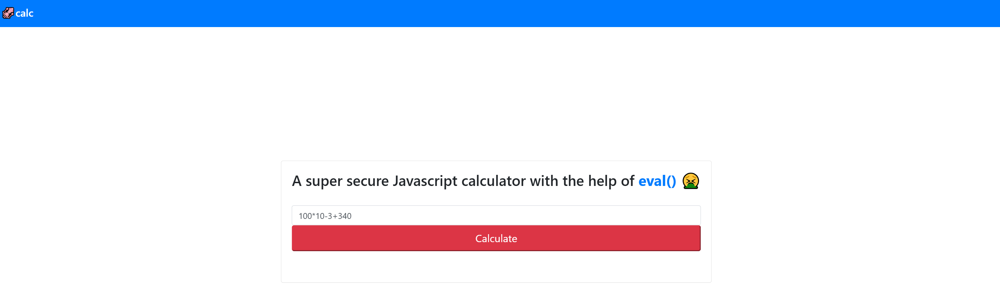
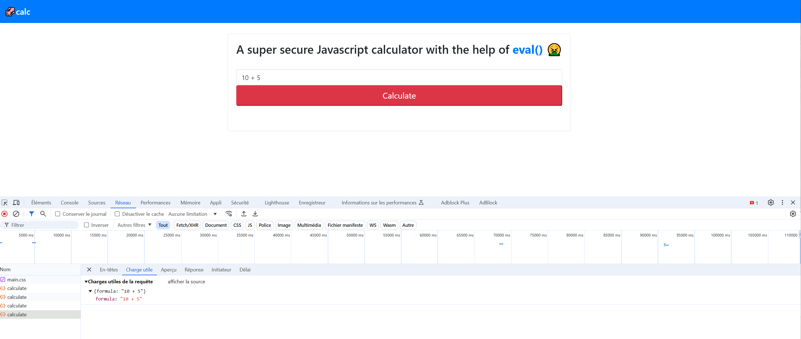
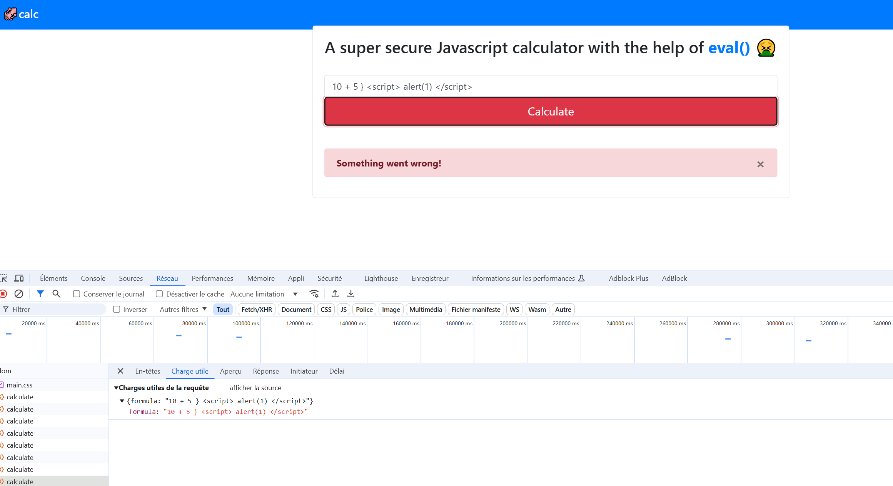
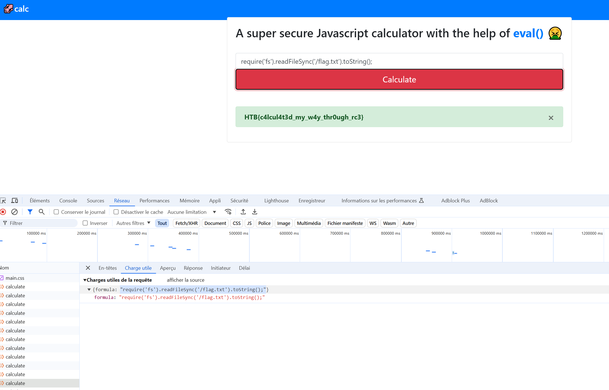

# jscalc

_write up par Arnolelavabo / A02halo / Arnaud_

## Détails du challenge 

Type de challenge - Web Difficulté - Easy

**Déroulé du challenge**

Je commence par me rendre sur l’application via l’IP fournie par HTB. La première chose qui m’interpelle c’est la mention de la fonction “eval()” je sais que c’est une fonction qui va nous permettre d’executer du code javascript qui n’est pas prévu par l’application à la base. C’est un premier point à noter et à tester. 

La plateforme fournit le code source du site mais avant tout je vais voir si je peux trouver la faille directement via les dev tools de mon navigateur. Et je tombe sur la fonction calculate qui reprend ce que l’utilisateur saisie dans le champs de texte pour faire son calcul. 

Je vais d’abord tester un truc tout simple pour voir si je peux injecter ce que je veux dans le champs (et si cela génère une erreur, quel type d’erreur). Là c’est bingo car j’ai effectivement une erreur mais je vois que ma commande peut-être passée à l’application. 

Je vérifie dans les fichiers que HTB mets à ma disposition et je vois qu’a la racine du projet docker se trouve un document “flag.txt”.  A ce moment on sait donc qu’on a un point d’injection en Javascript et que le fichier que l’on recherche doit se trouver à la racine du secteur. 

Je vérifie dans les fichiers mis à disposition par HTB, je vois qu’on fait appelle à express un lib Node. 
A partir de ce moment là on peut faire une injection qui va utiliser les filesystem pour lire notre document sur notre target. Avec un peu de recherche je tombe sur ce payload :   require('fs').readFileSync('/flag.txt').toString(); 

Je le met dans la barre de calcul de la cible et c’est le bingo. 

